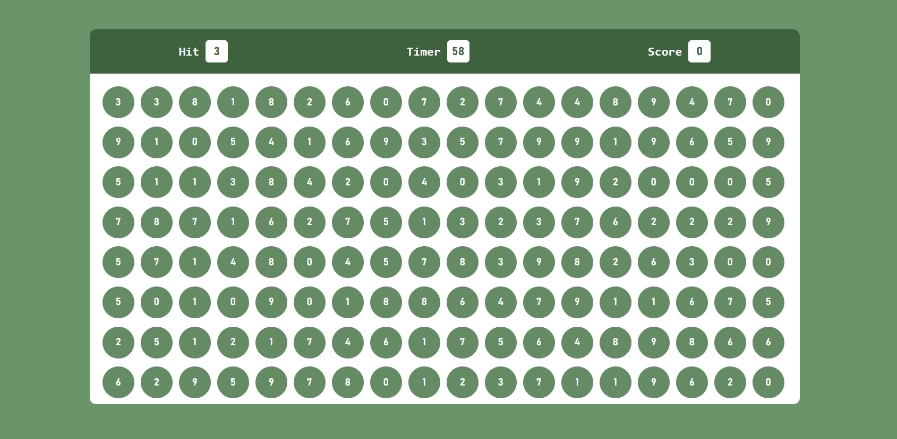

# Bubble Game Project

## Introduction
Welcome to the Bubble Game Project! This project is a simple JavaScript-based game that challenges players to pop bubbles within a time limit. It's an engaging and entertaining web application that showcases your coding skills.

## Project Overview
The Bubble Game Project consists of the following key components:

### 1. HTML Structure
The HTML file (`index.html`) defines the structure of the game:
- It includes a play area where bubbles appear.
- The top bar displays the player's score, hit value, and the remaining time.
- A "Start" button initiates the game.

### 2. CSS Styling
The CSS stylesheet (`style.css`) provides the visual styling for the game:
- It defines the appearance of bubbles, buttons, and other elements.
- The game's layout is designed to be visually appealing and user-friendly.
- Responsive design ensures the game adapts to different screen sizes.

### 3. JavaScript Functionality
The JavaScript code (`bubbleGame.js`) adds game logic and interactivity:
- Bubbles are dynamically generated and displayed on the screen.
- Players need to click on bubbles with a specific hit value to earn points.
- A timer counts down the remaining time, and the game ends when time runs out.
- The player's score is calculated and displayed at the end of the game.

## How to Play
To play the Bubble Game:
1. Click the "Start" button to begin the game.
2. Bubbles will appear on the screen, each with a numeric value.
3. Look for bubbles with the hit value displayed in the top bar.
4. Click on bubbles with the matching hit value to earn points.
5. The game ends when the timer reaches zero.
6. Your final score will be displayed on the screen.

## Future Enhancements
The Bubble Game can be further enhanced and expanded:
- Adding levels with increasing difficulty.
- Incorporating sound effects or music for a more immersive experience.
- Implementing a leaderboard to track high scores.
- Enhancing the game's graphics and animations.

## Conclusion
The Bubble Game Project is a fun and interactive web application that demonstrates your JavaScript programming skills. It's a great example of how coding can be used to create enjoyable user experiences.

Feel free to explore the code, modify it, or use it as a learning resource for your web development journey. Happy popping!

**Project Repository:** [Bubble Game Project on GitHub](https://github.com/krunal-gamit/bubbleGame-medium/)
