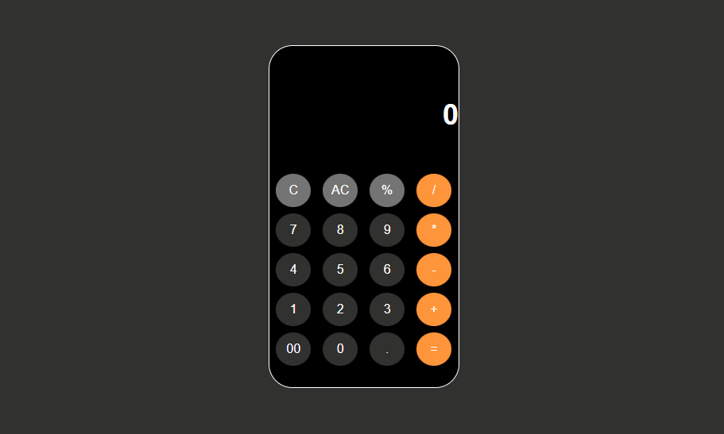

# Calculator Project

## Introduction
Welcome to the Calculator Project! This project showcases a simple web-based calculator built with HTML, CSS, and JavaScript. It provides basic arithmetic functionality, allowing users to perform addition, subtraction, multiplication, and division operations.

## Project Components
The Calculator Project consists of the following key components:

### 1. HTML Structure
The HTML file (`index.html`) defines the structure of the calculator web page. It includes:
- A display area for input and output.
- Numeric buttons for digits 0-9 and the decimal point.
- Function buttons for basic operations (addition, subtraction, multiplication, division).
- Special buttons for clearing input and performing calculations.

### 2. CSS Styling
The CSS stylesheet (`style.css`) provides the visual styling for the calculator:
- It defines the overall layout, color scheme, and button styles.
- Functional buttons are styled differently for easy identification.
- The calculator container has rounded corners and a modern appearance.

### 3. JavaScript Functionality
The JavaScript code (`calculator.js`) adds interactivity to the calculator:
- It handles button clicks, updating the input and display accordingly.
- Arithmetic operations are performed based on user input.
- The `eval` function is used to evaluate mathematical expressions.
- The calculator provides a responsive and user-friendly experience.

## Usage
To use the calculator, simply click the buttons to input digits and operations. Press the "=" button to calculate the result. The calculator is designed to handle basic mathematical calculations with ease.

## Future Enhancements
This calculator project can be further improved and expanded:
- Adding support for more advanced operations (e.g., square root, exponentiation).
- Implementing keyboard input for enhanced usability.
- Enhancing the visual design and responsiveness for various devices.

## Conclusion
The Calculator Project is a practical example of web development using HTML, CSS, and JavaScript. It serves as a foundation for creating more sophisticated calculator applications or integrating similar functionality into larger web projects.

Feel free to explore the code, modify it, or use it as a learning resource for your web development journey. Happy calculating!

**Live Project:** [Live Calculator Project](https://krunal-gamit.github.io/caclulator-basic/)

**Project Repository:** [Calculator Project on GitHub](https://github.com/krunal-gamit/caclulator-basic)

