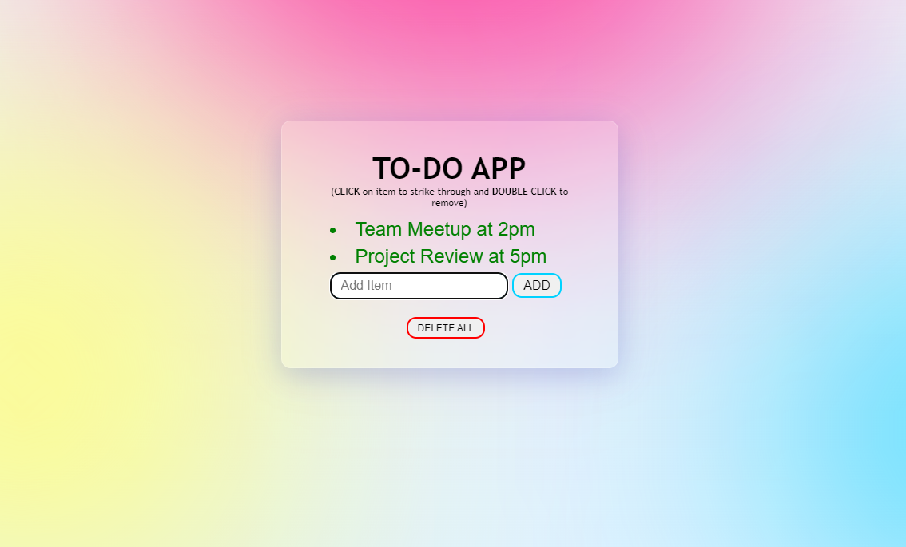

# To-Do App Project

## Introduction
Welcome to the To-Do App Project! This project is a simple web-based to-do list application built with HTML, CSS, and JavaScript. It provides a straightforward way to manage tasks, mark them as done, and remove them when completed.

## Project Overview
The To-Do App Project consists of the following key components:

### 1. HTML Structure
The HTML file (`index.html`) defines the structure of the application:
- It includes a title, description, and an input field for adding new tasks.
- A list displays the tasks, and each task can be marked as done or removed.

### 2. CSS Styling
The CSS stylesheet (`todo.css`) provides the visual styling for the application:
- It defines the layout, colors, fonts, and button styles.
- Tasks can be marked with a line-through when completed.

### 3. JavaScript Functionality
The JavaScript code (`todo.js`) adds interactivity to the to-do list:
- It allows users to add tasks by clicking the "Add" button or pressing Enter.
- Double-clicking a task removes it from the list.
- Clicking a task marks it as done with a red line-through.
- The "Delete All" button clears all tasks and refreshes the page.

## How to Use
To use the To-Do App:
1. Enter a task in the input field.
2. Click the "Add" button or press Enter to add the task to the list.
3. Double-click a task to remove it.
4. Click a task to mark it as done with a red line-through.
5. Click the "Delete All" button to clear all tasks and start fresh.

## Future Enhancements
The To-Do App can be enhanced with additional features:
- Task categories or labels.
- Task due dates and deadlines.
- User authentication for saving tasks across sessions.
- Improved mobile responsiveness and accessibility.

## Conclusion
The To-Do App Project is a practical example of web development using HTML, CSS, and JavaScript. It serves as a starting point for creating more advanced to-do list applications and demonstrates basic interactive web functionality.

Feel free to explore the code, modify it, or use it as a learning resource for your web development journey. Stay organized and keep track of your tasks with ease!

**Live Project:** [Live Project on GitHub](https://krunal-gamit.github.io/todoApp-basic/)

**Project Repository:** [To-Do App Project on GitHub](https://github.com/krunal-gamit/todoApp-basic)
